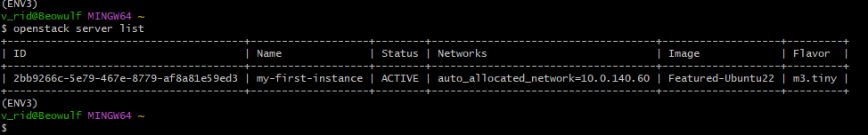
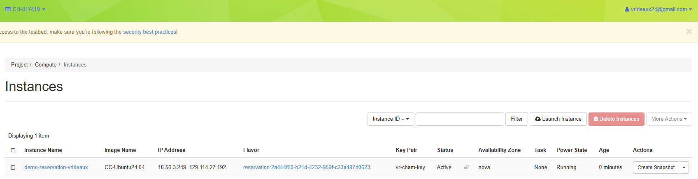

## Jetstream VM

## Chameleon Cloud VM

## Comparison

The use of the VM on the local machine was very similar to how it was on Jetstream 2. Both were mostly initialized through Git Bash and connected via SSH. The biggest difference is that with Oracle VirtualBox, it connects directly to a graphical interface (i.e., Ubuntu) when restarted after setup. Extra steps are required to set up an interface for Jetstream 2, such as using Exosphere.

Getting started on Chameleon Cloud via Horizon felt much simpler. Since most of what you need to start an instance is contained within the wizard, the amount of command-line work required is minimal compared to the other two options, allowing for faster initial setup.

Overall, VirtualBox followed by Chameleon Cloud are the preferred methods.
