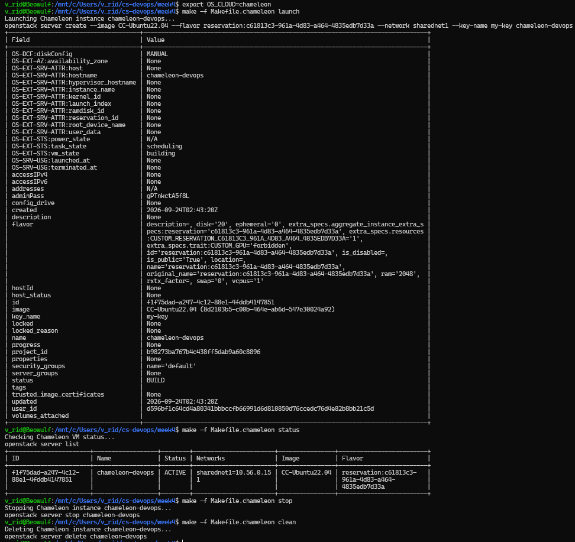

# Assignment 4.3: Chameleon Cloud Instance Management (KVM@TACC)

## Cloud VM Lifecycle Execution

```bash
v_rid@Beowulf:/mnt/c/Users/v_rid/cs-devops/week4$ export OS_CLOUD=chameleon

v_rid@Beowulf:/mnt/c/Users/v_rid/cs-devops/week4$ make -f Makefile.chameleon launch
Launching Chameleon instance chameleon-devops...
openstack server create --image CC-Ubuntu22.04 --flavor reservation:c61813c3-961a-4d83-a464-4835edb7d33a --network sharednet1 --key-name my-key chameleon-devops

v_rid@Beowulf:/mnt/c/Users/v_rid/cs-devops/week4$ make -f Makefile.chameleon status
Checking Chameleon VM status...
openstack server list
+--------------------------------------+------------------+--------+-------------------+----------------+-----------------------------------+
| ID                                   | Name             | Status | Networks          | Image          | Flavor                            |
+--------------------------------------+------------------+--------+-------------------+----------------+-----------------------------------+
| 1fc8340f-29f3-4f3a-b548-65e08e2f48f6 | chameleon-devops | ACTIVE | sharednet1=10.56.1.8 | CC-Ubuntu22.04 | reservation:c61813c3-961a-4d83-a464-4835edb7d33a |
+--------------------------------------+------------------+--------+-------------------+----------------+-----------------------------------+

v_rid@Beowulf:/mnt/c/Users/v_rid/cs-devops/week4$ make -f Makefile.chameleon stop
Stopping Chameleon instance chameleon-devops...
openstack server stop chameleon-devops

v_rid@Beowulf:/mnt/c/Users/v_rid/cs-devops/week4$ make -f Makefile.chameleon clean
Deleting Chameleon instance chameleon-devops...
openstack server delete chameleon-devops
```
