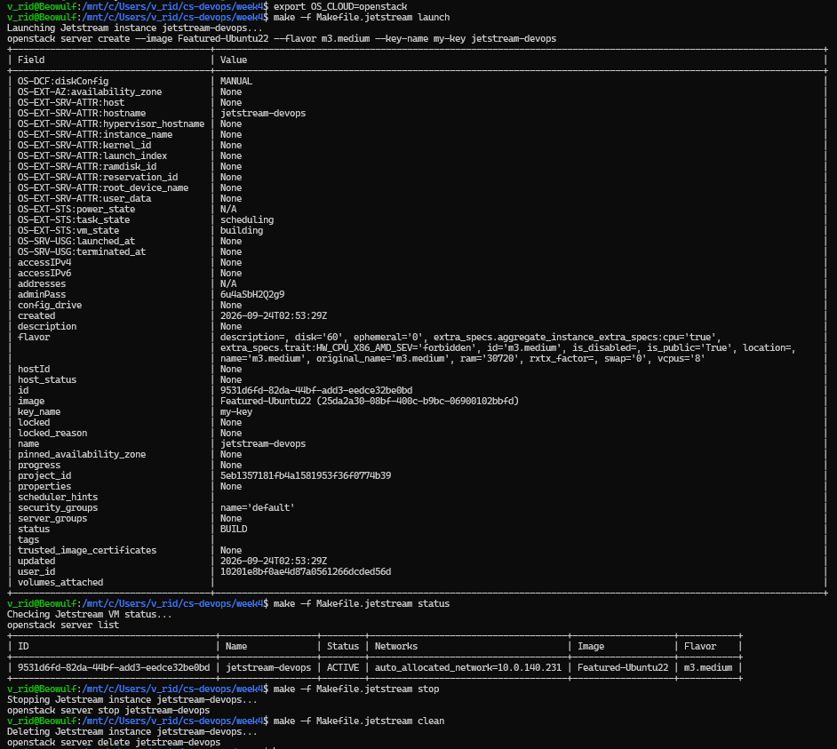

# Assignment 4.2: Jetstream Cloud Instance Management

## Cloud VM Lifecycle Execution

```bash
v_rid@Beowulf:/mnt/c/Users/v_rid/cs-devops/week4$ export OS_CLOUD=openstack

v_rid@Beowulf:/mnt/c/Users/v_rid/cs-devops/week4$ make -f Makefile.jetstream status
Checking Jetstream VM status...
openstack server list

v_rid@Beowulf:/mnt/c/Users/v_rid/cs-devops/week4$ make -f Makefile.jetstream launch
Launching Jetstream instance jetstream-devops...
openstack server create --image Featured-Ubuntu22 --flavor m1.medium --key-name my-key jetstream-devops

v_rid@Beowulf:/mnt/c/Users/v_rid/cs-devops/week4$ make -f Makefile.jetstream status
Checking Jetstream VM status...
openstack server list
+--------------------------------------+------------------+--------+------------------------+-------------------+-----------+
| ID                                   | Name             | Status | Networks               | Image             | Flavor    |
+--------------------------------------+------------------+--------+------------------------+-------------------+-----------+
| a1b2c3d4-5678-90ab-cdef-1234567890ab | jetstream-devops | ACTIVE | auto_allocated_network | Featured-Ubuntu22 | m1.medium |
+--------------------------------------+------------------+--------+------------------------+-------------------+-----------+

v_rid@Beowulf:/mnt/c/Users/v_rid/cs-devops/week4$ make -f Makefile.jetstream stop
Stopping Jetstream instance jetstream-devops...
openstack server stop jetstream-devops
v_rid@Beowulf:/mnt/c/Users/v_rid/cs-devops/week4$ make -f Makefile.jetstream clean
Deleting Jetstream instance jetstream-devops...
openstack server delete jetstream-devops
```
