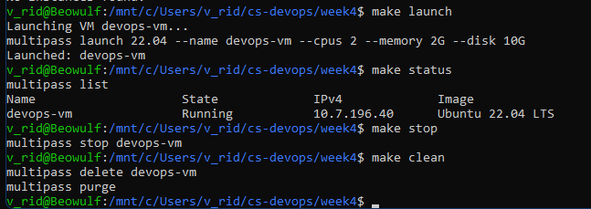

# Assignment 4.1: Local VM Management with Multipass

## VM Lifecycle Execution

```bash
v_rid@Beowulf:/mnt/c/Users/v_rid/cs-devops/week4$ make launch
Launching VM devops-vm...
multipass launch 22.04 --name devops-vm --cpus 2 --memory 2G --disk 10G
Launched: devops-vm

v_rid@Beowulf:/mnt/c/Users/v_rid/cs-devops/week4$ make status
multipass list
Name                    State           IPv4             Image
devops-vm               Running         10.7.196.142     Ubuntu 22.04 LTS

v_rid@Beowulf:/mnt/c/Users/v_rid/cs-devops/week4$ make stop
multipass stop devops-vm

v_rid@Beowulf:/mnt/c/Users/v_rid/cs-devops/week4$ make clean
multipass delete devops-vm
multipass purge
```
